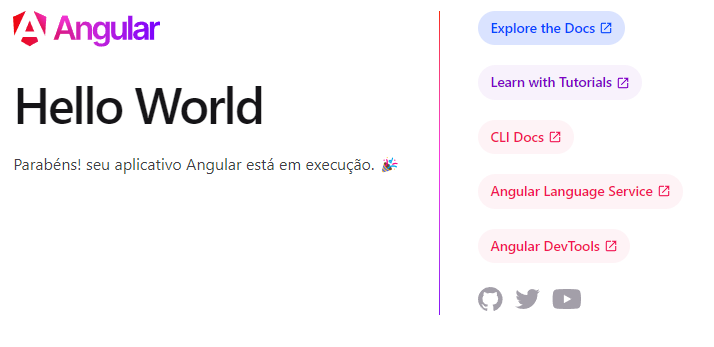

<div align="center">

</div>

---

## Trilha FullStack- Unidade V (Angular) - Prática 1


### :bookmark_tabs: Descrição

Chegamos no centro da primeira parte do nosso curso. Nesta unidade, aprenderemos a usar o framework Angular para criar o <em>frontend</em> da nossa aplicação. Vamos lá!

#### O que vamos desenvolver?

Uma aplicação de cursos na área de TI baseado no Restic36. Basicamente, a aplicação mostra diferentes cursos em cards, que, quando clicados, mostram uma descrição mais detalhada daquele curso. Além disso, usaremos um formulário para realizar o cadastro de novos cursos.

Nesta primeira prática, aprenderemos a fazer a instalação do angular, usando o npm do node, e como criar e rodar um projeto.

### :wrench: Instalação das Ferramentas

1. <em>Node.js</em>
   
   Para instalar o <em>node.js</em> basta entrar no link [npm install -g json-server](https://nodejs.org/pt), fazer o download da versão para seu SO e proceder a instalação.

   Caso esteja usando o linux, pode usar os seguintes comandos

    
```shell
    # installs nvm (Node Version Manager)
curl -o- https://raw.githubusercontent.com/nvm-sh/nvm/v0.39.7/install.sh | bash

# download and install Node.js (you may need to restart the terminal)
nvm install 20

# verifies the right Node.js version is in the environment
node -v # should print `v20.15.0`

# verifies the right NPM version is in the environment
npm -v # should print `10.7.0`
```

2. Instalação do Angular CLI

Com o Node.js e npm instalados, podemos proceder com a instalação do Angular CLI. O Angular CLI é uma ferramenta de linha de comando que facilita a criação, compilação e execução de aplicativos Angular. Para instalar o Angular CLI globalmente, execute o seguinte comando:

```shell
npm install -g @angular/cli
```
3. Instalação da Extensão do vsCode

Para ajudar no desenvolvimento de aplicações em Angular você pode instalar alguma extensão disponível no vsCode. A extensão oficial é o <b>Angular Language Service</b>.


### :page_facing_up: Utilização

Agora podemos criar um novo projeto em Angular. Abra o terminal ou prompt de comando e navegue até o diretório onde deseja criar o projeto. Em seguida, execute o seguinte comando:

```shell
ng new nome-do-projeto
```

Substitua "nome-do-projeto" pelo nome desejado para o seu projeto. Para o exemplo que vamos desenvolver durante o curso, nomeamos o nosso projeto como <b>CursosRestic</b>. O Angular CLI criará uma nova pasta com o nome do projeto e configurará a estrutura básica do projeto Angular dentro dela. Durante o processo de criação do projeto, você será solicitado a escolher algumas opções, como o estilo de folha de estilos a ser usado (por exemplo, CSS, SCSS, etc.).

Após criar o projeto Angular, você pode navegar até o diretório do projeto e iniciar o servidor de desenvolvimento com o seguinte comando:

```shell
cd nome-do-projeto 
ng serve --open
```
Isso iniciará o servidor de desenvolvimento Angular e abrirá automaticamente o aplicativo em seu navegador padrão (figura abaixo). Qualquer alteração que você fizer nos arquivos do projeto será automaticamente recarregada no navegador, permitindo um processo de desenvolvimento mais eficiente e interativo.




### :hammer: Mãos a Obra

Estude a estrutura do projeto criado. Identifique os arquivos html, css, typescript, etc. Na próxima prática iniciaremos a desenvolver componentes, baseado nessa estrutura.

### :triangular_flag_on_post: Licença
<p>
Todos os direitos reservados para Restic36 (Residência em Software: Bahia + Tecnologia + Empreendedorismo)
</p>