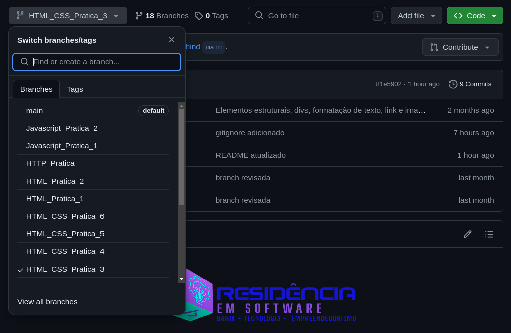

<div align="center">

</div>

---

## Trilha FullStack


Seja bem-vindo (a) ao repositório da trilha de Fullstack do Restic36 - Parte 1 (Frontend)!

Aqui você vai encontrar os códigos de exemplos de cada unidade da primeira parte da nossa trilha que será voltada para o <em>frontend</em>. Este repositório está estruturado em 17 branchs que vai avançando no desenvolvimento da aplicação web, desde as linguagens básicas HTML, CSS e Javascript até o <b>Angular</b>, foco principal dessa primeira parte.

O repositório está estruturado da seguinte forma

1. <u>Unidade I - HTML/CSS (6 branches)</u>

| Prática | Descrição | Branch|
|---------|-----------|-------|
|I  |   Estrutura básica do html (<code>html, head, body</code>) e tags básicas como <code>title, h, div, footer, ul, li, p</code>. |<em>HTML_Pratica_1</em>|
|II  |   Adição de outras tags como (<code>table e forms</code>), além das tags <code>input, select, option, fieldset, th, td, tr, thead</code> e etc. |<em>HTML_Pratica_2</em>|
|III  |   Inserção do CSS na página HTML. Análise da tag <code> link </code> e entendimento sobre como adicionar propriedades em elementos ID, class e tags. |<em>HTML_CSS_Pratica_3</em>|
|IV  |   Inserção de estilo no HTML criado nas práticas iniciais. |<em>HTML_CSS_Pratica_4</em>|
|V  |  Flexbox Layout |<em>HTML_CSS_Pratica_5</em>|
|VI  |  Media Queries |<em>HTML_CSS_Pratica_6</em>|
    
2. <u>Unidade II - Github</u>

Esta unidade não possui branch específica.  

3. <u>Unidade III - Javascript (2 branches)</u>

| Prática | Descrição | Branch|
|---------|-----------|-------|
|I  | Conceitos básicos do Javascript: variáveis, loop, DOM e funções. |<em>Javascript_Pratica_1</em>|
|II  | Inserção de código Javascript na aplicação HTML/CSS desenvolvida na unidade I. |<em>Javascript_Pratica_II</em>|

4. Unidade IV - Protocolo HTTP (1 branch)

| Prática | Descrição | Branch|
|---------|-----------|-------|
|I  | Chamadas HTTP e <em>json-server</em>.|<em>HTTP_Pratica</em>|


1. Unidade V - Angular

| Prática | Descrição | Branch|
|---------|-----------|-------|
|I  | Inicialização de novo projeto com <code>ng new</code> e visualização com <code>ng serve</code>.|<em>Angular_Pratica_1</em>|
|II  | Componentes |<em>Angular_Pratica_2</em>|
|III  | Diretivas |<em>Angular_Pratica_3</em>|
|IV  | Roteamento |<em>Angular_Pratica_4</em>|
|V  | Serviços |<em>Angular_Pratica_5</em>|
|VI  | Formulários |<em>Angular_Pratica_6</em>|
|VII  | HTTP |<em>Angular_Pratica_7</em>|

### :bookmark_tabs: Como usar?

O acesso as <em>branches</em> pode acontecer de duas formas: direto pelo <b>Github</b> ou no seu <b>repositório local</b>, depois de clonado.

1. Github

Você pode acessar as <em>branches</em> diretamente pelo seletor



2. Repostiório Local

Primeiro você deve fazer o clone do repositório

```shell
git clone https://github.com/andouglasjr/Restic36-FullStack
```
No diretório criado, você pode alternar entre as <em>branches</em> com o seguinte comando

```shell
git checkout <nome_da_branch>
```
Além disso, para visualizar as <em>branches</em> você pode usar o seguinte comando

```shell
git branch
```
### :hammer: Mãos a Obra

Explore o nosso repositório, faça a clonagem e comece a visualizar os exemplos localmente a medida que você avança nas unidades. Bons estudos!

### :triangular_flag_on_post: Licença
<p>
Todos os direitos reservados para Restic36 (Residência em Software: Bahia + Tecnologia + Empreendedorismo)
</p>