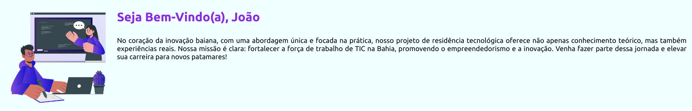
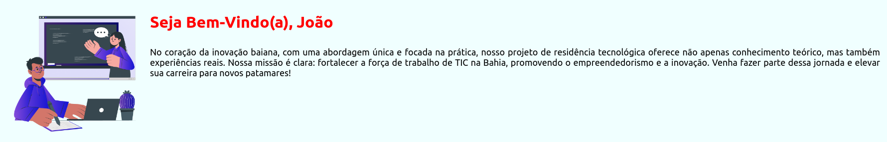

<div align="center">

</div>

---

## Trilha FullStack- Unidade III (Javascript) - Prática 1


### :bookmark_tabs: Descrição

A aplicação que foi desenvolvida até agora não tem dinamicidade. As informações são estáticas e não há interação com o usuário. Nesta unidade, adicionaremos lógica a nossa aplicação usando <b>Javascript</b>.

Na primeira prática apenas abordaremos alguns conceitos básicos da linguagem, como: variáveis, utilização do DOM, funções e loops. Vamos lá!

1. <u>Exemplo - Alteração dinâmica no nome do usuário</u>

Em aplicações reais, quando um usuário entra no sistema, recebemos suas informações do servidor e podemos apresenta-las no front da nossa aplicação. Para fazer a interação com o template, podemos fazer uso do DOM para fazer a inserção desses dados de forma dinâmica. 

Aqui, faremos um exemplo simples de apresentar o nome do usuário na tela. Lembrando que essa informação seria recebida do servidor, mas para fins de simplificação do exemplo, apenas criaremos uma variável <em>username</em>.

```javascript
var username = "João";
var texto_nome = document.getElementById('username');
texto_nome.textContent = `Seja Bem-Vindo(a), ${username}`;
```

Neste exemplo, atribuímos o valor 'João' a variável <em>username</em>. Na segunda linha, usamos o objeto <em>document</em> do DOM para obter o elemento que tem o id 'username' no template. Por fim, acessamos o conteúdo deste elemento usando a prorpiedade <em>.textContent</em> e alteramos para `Seja Bem-Vindo(a), ${username}`. Perceba que o nome João será inserido no lugar de '${username}'.



2. <u>Exemplo - Sintáxe de Controle (IF)</u>

Podemos usar uma sintaxe condicional para fazer modificações na página. Apenas para exemplificar: vamos supor que a cor do nome muda de acordo com o nome do usuário.

```javascript
if(username === "João"){
    texto_nome.style.color = 'red';
}else{
    texto_nome.style.color = 'blue';
}
```



3. <u>Exemplo - Sintáxe de Controle (FOR)</u>

Também podemos usas loops no Javascript. 

```javascript
for(var i=0;i<5;i++){
    console.log('Loop:', i);
}
```

Aqui nós utilizamos uma estrutura muito util, principalmente para testes de código, que é o <code>console.log()</code>. Desta forma, podemos mostrar no console do <em>Dev Tool</em> do navegador, valores de variáveis, resultado de condições lógicas, erros, entre outras informações importantes durante o desenvolvimento da aplicação.

### :hammer: Mãos a Obra

Insira outras funcionalidades a aplicação usando Javascript. Substitua o <code>for</code> do exemplo, pelo <code>while</code>. Crie uma estrutura de dados de usuário e adicione essas informações em outras parte do template.

### :triangular_flag_on_post: Licença
<p>
Todos os direitos reservados para Restic36 (Residência em Software: Bahia + Tecnologia + Empreendedorismo)
</p>